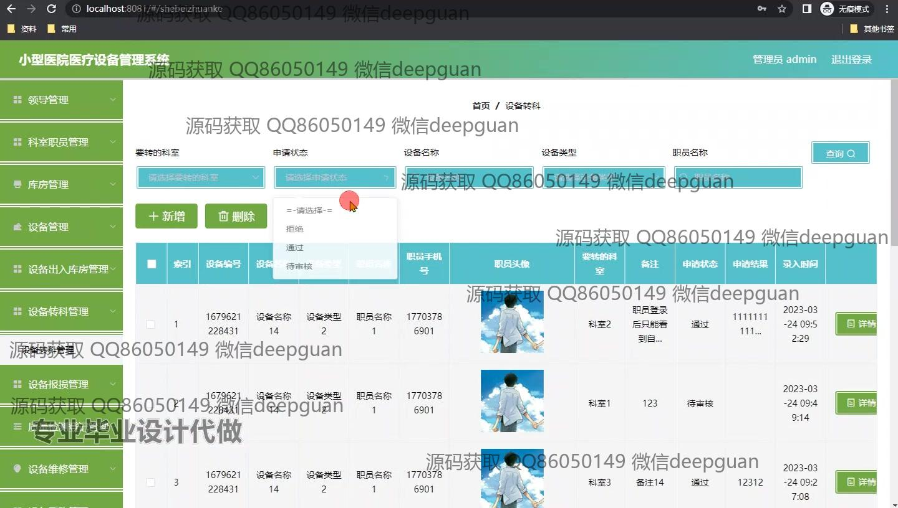

<h1 align="center">小型医院医疗设备管理系统</h1>

## 简介
小型医院医疗设备管理系统：角色分为管理员、科室职员，功能包括设备管理、出入库管理、库存管理、科室管理、设备报损报废管理及设备采购计划等，提升医院设备管理效率。    --计算机毕业设计源码；毕设源码；java毕业设计源码

## 联系方式

<h3 align="center">获取完整代码与数据库文件 + 微信：deepguan QQ: 86050149 QQ群: 783742310</h3>

<h3 align="center">可帮忙远程部署 包运行成功！提供远程部署、修改代码、设计文档指导、代码讲解等服务！</h3>

## 功能介绍（完整见运行截图）
管理员：管理员可通过系统进行登录、注册和退出操作，访问系统首页及其主导航栏模块。具备医疗设备的增删改查权限，管理设备进出库、转科、报损报废和采购审核等操作。可以查看和修改科室职员的信息，重置密码，以及处理公告发布。系统支持全局的设备状态和库存管理，提升设备的高效利用及资源调配。

科室管理人员：允许管理科室内的医疗设备信息，包括设备的查询、入库审核、状态变更和调动。可记录和跟踪设备的使用情况、维修进度及相关的报损处理。管理科室职员信息，与管理员配合完成科室设备的调度和维护。可通过个人中心更新个人信息，查看历史记录及处理设备相关申请。

库房管理人员：负责医院设备的库房管理模块处理，并对设备的库存信息进行输入、修改与维护。支持设备的出入库管理，实时更新库存状态，确保设备的合理分配和有效管理。系统帮助记录设备的详细数据，包括设备名称、编号和数量变化，保障设备可用性和维护历史。

普通用户：通过系统参与设备的基本信息查阅，申请领用或转科等操作，确保设备在医院内的合理运行与管理。支持个人中心查看与更新个人信息，提供身份验证以保障用户数据安全。可查看自己负责设备的申请状态和审批结果，提高日常设备管理效率。

## 运行截图

本代码来源于网络,仅供学习参考使用!

